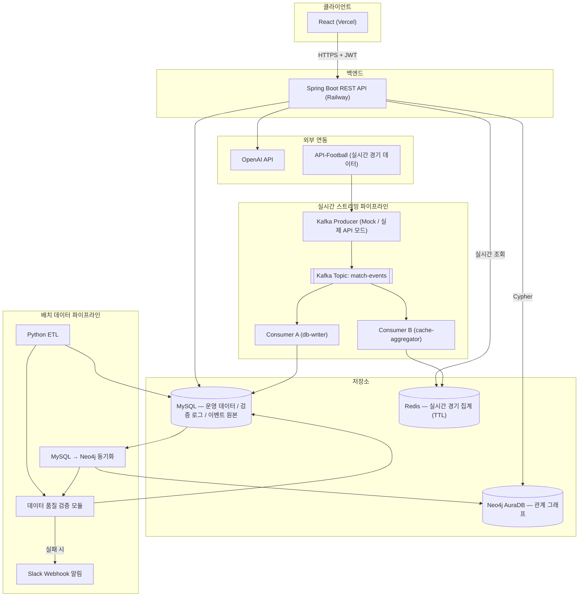

## 프로젝트 개요

축구 팬이 원하는 포메이션에 자신만의 베스트 11을 구성하고, 그래프 기반 추천과 AI 코멘트를 받아보는 풀스택 웹 서비스. 기획부터 데이터 파이프라인, 백엔드, 프론트엔드, 배포까지 전 과정을 1인 개발했으며, 이후 데이터 엔지니어링 역량 확장을 위해 **데이터 품질 모니터링 시스템**과 **Kafka 기반 실시간 경기 이벤트 스트리밍 파이프라인**을 추가로 구축했습니다.

- **배포 URL**: https://my-best-11-fe-inky.vercel.app
- **API 문서**: https://mybest11-be-production.up.railway.app/swagger-ui/index.html
- **GitHub**: https://github.com/hyunsu1004/MyBEST11-BE

---

## 역할

풀스택 개발자 겸 데이터 엔지니어로서 아래 전 영역을 단독으로 설계·구현했습니다.

- 요구사항 정의, ERD 및 API 설계
- Spring Boot 기반 백엔드 개발 (인증, 도메인 로직, 예외 처리)
- Python ETL 파이프라인 설계 및 구현
- MySQL–Neo4j 폴리글랏 퍼시스턴스 아키텍처 설계
- React 프론트엔드 개발
- 외부 LLM API(OpenAI) 연동
- 클라우드 배포 및 인프라 구성 (Railway, Vercel, Neo4j AuraDB)
- **ETL 파이프라인 데이터 품질 검증 체계 설계 및 모니터링 대시보드 구축**
- **Kafka 기반 실시간 이벤트 스트리밍 아키텍처 설계 및 구현 (Producer/Consumer, Docker 로컬 환경, Railway 배포)**

---

## 기술 스택

| 영역 | 기술 |
|---|---|
| Backend | Java 17, Spring Boot 3.5, Spring Data JPA, Spring Security, JWT |
| Database | MySQL 8.0 (Railway), Neo4j (AuraDB) |
| Migration | Flyway |
| Data Pipeline | Python, pymysql, requests, python-dotenv, neo4j-driver |
| **Streaming** | **Apache Kafka (KRaft), kafka-python, Redis** |
| **Data Quality** | **자체 검증 모듈(row count / null ratio / duplicate / schema 체크), Slack Webhook 알림** |
| Frontend | React 19, Vite, React Router, Axios |
| AI 연동 | OpenAI API (GPT-4o-mini) |
| API 문서화 | springdoc-openapi (Swagger) |
| **컨테이너/오케스트레이션** | **Docker, Docker Compose (로컬 Kafka/Redis 환경)** |
| 배포 | Railway (Backend, MySQL, Kafka, Redis), Vercel (Frontend), Neo4j AuraDB |
| 버전관리/협업 | Git, GitHub |

---

## 시스템 아키텍처

**설계 근거**:
- 트랜잭션성 CRUD(회원, 라인업 저장)는 MySQL이 담당하고, "같은 팀 동료", "유사 포지션 선수" 같은 다단계 관계 탐색은 Neo4j Cypher 쿼리로 처리. 동일 요구사항을 SQL 다중 JOIN으로 구현하는 것보다 그래프 순회가 직관적이고 확장에 유리하다는 판단 하에 폴리글랏 퍼시스턴스로 설계.
- 실시간 경기 이벤트는 **같은 Kafka 토픽을 서로 다른 Consumer Group(`db-writer`, `cache-aggregator`)이 각자 독립적으로 구독**하는 구조로 설계해, "영구 보관(MySQL)"과 "빠른 실시간 조회(Redis, TTL 6시간)"라는 서로 다른 목적을 하나의 이벤트 스트림에서 동시에 만족.
- 데이터 품질 검증은 ETL 실행 직후 자동으로 트리거되어, 실패 시 Slack으로 즉시 알림 → 운영 관측성(Observability)을 파이프라인 설계 단계부터 내재화.

---

## 핵심 기능

- JWT 기반 stateless 인증
- 포메이션(4-3-3/4-4-2/3-5-2) 기반 라인업 빌더, 포지션별 선수 배치
- 선수 검색(디바운스 적용) 및 실시간 배치
- 그래프 기반 추천 (같은 팀 동료 / 같은 리그 유사 포지션)
- LLM 기반 라인업 전술 평가 코멘트
- Python ETL 파이프라인 (upsert 패턴, 재실행 안전성 확보)
- **ETL 데이터 품질 자동 검증 (row count, null 비율, 중복, 스키마, MySQL-Neo4j 정합성) 및 Slack 알림**
- **데이터 품질 모니터링 대시보드** (실행 이력별 검증 결과 시각화)
- **Kafka 기반 실시간 경기 이벤트 스트리밍** (득점/카드/교체 이벤트, 파티션 키로 경기별 순서 보장)
- **실시간 경기 스코어보드** (5초 폴링, Redis 기반 실시간 집계 조회)

## neo4j를 활용한 선수 또는 팀들간 관계 시각화

  

## 내가 구상한 BEST 11 의 AI 코멘트

## 데이터 품질 모니터링 대시보드

ETL 실행 이력별로 검증 항목(ROW_COUNT / NULL_RATIO / DUPLICATE / SCHEMA / CONSISTENCY)의 PASS/FAIL 결과를 시각화. 실패 시 Slack으로 자동 알림.

## 실시간 경기 스코어보드

Kafka로 발행된 경기 이벤트가 Redis 집계를 거쳐 5초 간격으로 갱신되는 실시간 스코어보드.

---

## 트러블슈팅 & 문제 해결

### 1. 폴리글랏 퍼시스턴스 환경에서의 트랜잭션 매니저 충돌

**문제**: MySQL(JPA)과 Neo4j를 함께 사용하는 상황에서, Neo4j Repository 쿼리 실행 시 `NullPointerException: txTemplate is null` 발생.

**원인 분석**: Spring Boot는 애플리케이션에 하나의 주 트랜잭션 매니저만 자동 구성하며, JPA가 우선 감지되어 Neo4j용 트랜잭션 매니저가 등록되지 않은 상태였음.

**해결**: `Neo4jTransactionManager`를 별도 Bean으로 명시적으로 등록하고, 서비스 메서드에 `@Transactional("neo4jTransactionManager")`로 트랜잭션 경계를 명시적으로 분리하여 두 저장소의 트랜잭션이 독립적으로 관리되도록 구성.

**배운 점**: 여러 데이터스토어를 한 애플리케이션에서 다룰 때는 트랜잭션 경계를 명시적으로 설계해야 하며, Spring Boot의 자동 구성에 의존할 수 없는 지점을 식별하는 것이 중요함.

---

### 2. Flyway 도입 중 발견한 숨은 스키마 결함

**문제**: 개발 초기 `ddl-auto: create-drop`으로 운영하다가, 배포를 앞두고 Flyway 기반 마이그레이션으로 전환하는 과정에서 `Schema-validation: missing column [titie] in table [best_eleven]` 에러 발생.

**원인 분석**: Entity 클래스에 `title` 필드가 `titie`로 오타가 있었으나, `create-drop` 모드에서는 Hibernate가 엔티티 필드명 그대로 테이블을 생성했기 때문에 오타가 계속 은폐되어 있었음. Flyway로 정확한 스펠링의 마이그레이션 스크립트를 작성하자, 스키마 검증 과정에서 불일치가 드러남.

**해결**: Entity 필드명을 수정하고 관련 DTO를 함께 점검.

**배운 점**: `ddl-auto: create-drop`은 개발 편의성은 높지만 스키마 결함을 은폐할 수 있음을 체감. 명시적 스키마 관리(Flyway) 도입이 코드 품질 검증 수단으로도 기능한다는 것을 실무적으로 확인.

---

### 3. 외부 API 제약에 따른 데이터 소싱 전략 전환

**문제**: 무료 축구 데이터 API(football-data.org)를 사용해 ETL 파이프라인을 구축하던 중, 선수단(squad) 및 팀 목록 엔드포인트가 무료 티어에서 제한되어 있음을 확인 (403 Forbidden).

**의사결정**: 유료 구독 대신, 팀 목록은 접근 가능한 기본 API 엔드포인트로 확보하고, 선수 데이터는 CSV로 직접 큐레이션하는 방식으로 전환. API 의존성을 최소화하고 파이프라인 로직 검증에 집중하는 실용적 선택.

**구현**: `extract.py`/`transform.py`는 향후 API 재도입을 대비해 유지하되, `main.py`가 CSV 소스를 읽도록 재구성. 모든 적재 함수를 upsert 패턴(조회 후 삽입)으로 작성하여 파이프라인 재실행 시 중복 데이터가 발생하지 않도록 설계.

**배운 점**: 외부 의존성의 제약을 조기에 식별하고, 프로젝트 목표(파이프라인 검증)에 맞게 데이터 소싱 전략을 유연하게 전환하는 판단력.

---

### 4. 클라우드 배포 환경에서의 네트워크 계층 이슈

**문제**: Railway 배포 과정에서 세 단계에 걸쳐 서로 다른 네트워크 문제 발생.

1. 로컬에서 클라우드 DB 연결 시 `mysql.railway.internal` 사용 → `UnknownHostException` (내부 전용 주소를 외부에서 접근 시도)
2. 백엔드를 Railway에 배포했으나 동일 에러 재발 → MySQL과 백엔드 서비스가 서로 다른 Railway 프로젝트에 속해 있어 사설 네트워크가 분리되어 있었음
3. HTTPS로 서빙되는 Swagger 페이지에서 API 호출 시 Mixed Content 에러 → Railway가 외부 HTTPS 요청을 내부적으로 HTTP로 프록시하는데, Spring이 이를 인지하지 못해 자신을 HTTP 서버로 오인

**해결**:
1. 로컬 개발 시에는 Public 프록시 주소, 배포된 서비스 간 통신에는 Private 주소를 구분해서 사용
2. 두 서비스를 동일 프로젝트로 재구성해 사설 네트워크 공유
3. `server.forward-headers-strategy: framework` 설정으로 프록시 헤더(`X-Forwarded-Proto`)를 신뢰하도록 구성

**배운 점**: 클라우드 배포 환경에서는 "누가, 어디서 접속하는가"에 따라 내부/외부 네트워크 경로를 구분해서 설계해야 함을 체득. 로컬 개발 환경과 클라우드 배포 환경의 네트워크 토폴로지 차이를 이해하는 계기.

---

### 5. 재현 가능한 빌드를 위한 환경 명시

**문제**: Railway의 자동 빌드 시스템(Railpack)이 프로젝트의 Java 버전을 자동 감지하지 못해 빌드 실패.

**해결**: `RAILPACK_JDK_VERSION=17` 환경변수를 명시적으로 지정하여 빌드 환경의 JDK 버전을 고정. 이 과정에서 Nixpacks/Railpack 등 툴체인 간 설정 형식 차이를 확인하고, 파일 기반 설정보다 환경변수 기반 설정이 더 안정적임을 확인.

**배운 점**: 로컬 개발 환경에서 암묵적으로 가정하던 실행 환경(Java 버전 등)을 배포 시에는 명시적으로 선언해야 한다는 걸 실전에서 경험. Reproducible build의 중요성.

---

### 6. 로컬 Docker 환경 구축 중 발견한 가상화 계층 문제

**문제**: Kafka를 로컬 Docker로 띄우려는 과정에서 Docker Desktop이 "Virtualization support not detected"로 실행 자체가 되지 않음.

**원인 분석**: 메인보드 BIOS 레벨의 가상화(Intel VMX)는 이미 활성화되어 있었으나, Windows의 선택적 기능(Hyper-V, Virtual Machine Platform, Windows Subsystem for Linux)이 별도로 켜져 있지 않았음. BIOS 레벨 가상화 지원과 OS 레벨 가상화 지원은 독립적으로 각각 활성화되어야 한다는 점을 놓쳤던 것이 원인.

**해결**: `Windows 기능 켜기/끄기`에서 관련 기능을 모두 활성화 후 재부팅하여 WSL2/Docker Desktop 정상 구동 확인.

**배운 점**: "가상화가 비활성화됐다"는 에러 메시지가 항상 하드웨어(BIOS) 문제를 가리키는 것은 아니며, OS 기능 레벨의 문제일 수도 있다는 것을 실전에서 확인. 작업 관리자의 요약 정보만으로 판단하지 않고, 더 하위 레벨의 진단 도구(WSL 자체 에러 메시지 등)를 함께 참고해야 정확한 원인 파악이 가능했음.

---

### 7. 외부 컨테이너 이미지의 배포 정책 변경으로 인한 빌드 실패

**문제**: `docker compose up` 실행 시 `bitnami/kafka:3.7` 이미지를 찾을 수 없다는 에러 발생.

**원인 분석**: Bitnami가 정책을 변경하여, 기존에 무료로 제공되던 태그 기반 이미지 배포를 중단하고 유료 구독 고객에게만 제공하는 방식으로 전환. 코드나 설정 문제가 아니라 외부 서비스의 정책 변경이 원인.

**해결**: Apache Kafka 프로젝트가 직접 배포하는 공식 무료 이미지(`apache/kafka:3.7.0`)로 교체.

**배운 점**: 서드파티 컨테이너 이미지에 대한 의존은 언제든 정책이 바뀔 수 있음을 실감. 가능하면 원 프로젝트가 공식 배포하는 이미지를 우선 고려하는 것이 장기적으로 더 안정적이라는 판단 기준을 갖게 됨.

---

### 8. 이기종 환경(Spring/Python) 간 환경변수 스키마 불일치

**문제**: Python Kafka Consumer가 Railway MySQL이 아닌 `localhost`로 접속을 시도하며 인증 실패.

**원인 분석**: Consumer 코드가 `DB_HOST`, `DB_PORT` 등 개별 환경변수를 기대하도록 작성됐으나, 실제 `.env`는 Spring Boot 방식의 JDBC URL(`DB_URL=jdbc:mysql://...`) 하나로 관리되고 있어 존재하지 않는 변수들이 기본값(`localhost`)으로 처리됨.

**해결**: 개별 변수 대신 기존 `DB_URL`을 정규식으로 파싱해 호스트/포트/DB이름을 추출하도록 통일.

**배운 점**: 여러 언어/프레임워크가 같은 인프라를 공유할 때는 환경변수 스키마를 처음부터 통일하는 것이 중요함을 체감. 서로 다른 설정 관례가 섞이면 사일런트한 불일치가 발생하기 쉬움.

---

### 9. 클라우드 배포 환경의 인증 요구사항 누락

**문제**: Railway에 배포한 Consumer가 Redis에 데이터를 쓰지 못하고 "Authentication required" 에러 반복 발생.

**원인 분석**: 로컬 Docker Redis는 비밀번호 없이 접속 가능하도록 구성했으나, Railway가 제공하는 Redis는 기본적으로 인증이 활성화되어 있어 동일한 코드가 클라우드 환경에서는 인증 실패로 이어짐.

**해결**: Railway가 제공하는 `REDIS_URL`(비밀번호 포함 전체 접속 URL)을 우선적으로 사용하고, 없는 경우에만 기존 방식(호스트/포트/비밀번호 개별 조합)으로 폴백하도록 연결 로직을 분기 처리하여 로컬/배포 환경 모두에서 코드 수정 없이 동작하도록 구성.

**배운 점**: 로컬 개발 환경의 편의를 위해 생략한 설정(인증 등)이 클라우드 환경에서는 기본값으로 요구되는 경우가 많다는 것을 확인. 환경별 차이를 코드 레벨에서 흡수할 수 있도록 설정을 유연하게 설계하는 것이 배포 안정성에 중요함을 체득.

---

## 회고

- **폴리글랏 퍼시스턴스**: 단일 DB로는 자연스럽지 않은 요구사항(관계 탐색)을 그래프DB로 분리 설계하고, 그 과정에서 발생하는 트랜잭션 경계 문제를 직접 해결
- **데이터 파이프라인 설계**: 외부 API 제약이라는 현실적 문제에 부딪혔을 때, 목표에 맞게 전략을 전환하는 실용적 판단
- **스키마 관리의 중요성**: 임시방편(create-drop)에서 정식 마이그레이션 도구(Flyway)로 전환하며 겪은 문제가, 역설적으로 숨어있던 버그를 드러내는 안전장치 역할을 한다는 것을 체감
- **클라우드 인프라 이해**: 로컬 개발 환경과 배포 환경의 네트워크·런타임 차이를 다수의 시행착오를 통해 체득
- **관측성(Observability)을 설계 단계부터 고려**: ETL 파이프라인에 사후 디버깅이 아니라 사전 검증 체계(품질 검증 + 알림)를 내재화함으로써, "동작하는 파이프라인"과 "신뢰할 수 있는 파이프라인"의 차이를 실무적으로 경험
- **이벤트 기반 아키텍처로의 확장**: 배치 처리(ETL) 중심이던 파이프라인을, 같은 이벤트 스트림을 여러 목적(영구 저장/실시간 집계)으로 독립적으로 소비하는 Kafka 기반 스트리밍 구조로 확장하며 배치와 실시간 처리 각각의 트레이드오프를 실전에서 비교
- **인프라 비용/자원 제약 속 설계 판단**: 무료 API의 호출 한도, 클라우드 플랫폼의 무료 티어 리소스 한도 등 현실적 제약 속에서, 개발 효율(Mock 모드)과 실제 운영 가능성(비용 대비 아키텍처 선택)을 함께 고려하는 판단력을 기름

특히 "동작하는 코드"와 "운영 가능한 서비스" 사이에는 스키마 관리, 네트워크 구성, 환경 변수 관리, 그리고 이번에 새롭게 경험한 컨테이너 이미지 정책 변화·언어 런타임 호환성·클라우드 인증 요구사항처럼 눈에 보이지 않는 인프라적 고려사항이 많다는 것을 배포 과정에서 절실히 느꼈습니다. 이러한 문제들은 대부분 코드 로직이 아니라 "코드가 실행되는 환경"에 대한 이해 부족에서 비롯됐다는 공통점이 있었고, 이는 데이터 엔지니어로서 파이프라인 로직뿐 아니라 그 파이프라인이 놓이는 인프라 전반을 이해해야 한다는 확신으로 이어졌습니다.
