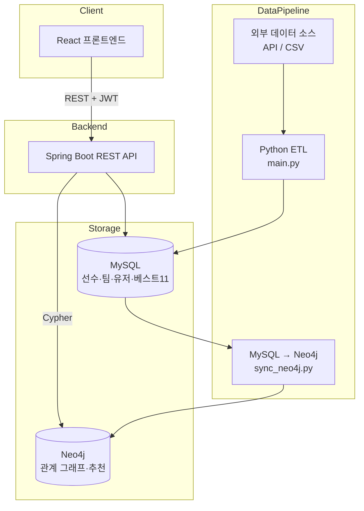
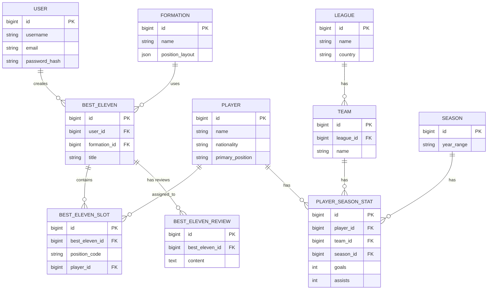

# ⚽ Best 11 — 나만의 베스트 일레븐 빌더

축구 팬이 원하는 포메이션에 자신만의 베스트 11을 구성하고, 그래프 기반 추천을 받아보는 풀스택 프로젝트입니다.

> 스포츠 데이터 엔지니어링을 지향하며, **관계형 DB(MySQL)와 그래프 DB(Neo4j)를 함께 사용하는 폴리글랏 퍼시스턴스**, **Python ETL 파이프라인**, **Spring Boot 기반 REST API**, **React 프론트엔드**를 엔드투엔드로 직접 설계·구현했습니다.

---

## 목차

- [기술 스택](#기술-스택)
- [시스템 아키텍처](#시스템-아키텍처)
- [ERD](#erd)
- [핵심 기능](#핵심-기능)
- [프로젝트 구조](#프로젝트-구조)
- [로컬 실행 방법](#로컬-실행-방법)
- [설계 결정과 트러블슈팅](#설계-결정과-트러블슈팅)
- [로드맵](#로드맵)

---

## 기술 스택

| 영역 | 기술 |
|---|---|
| Backend | Java 17, Spring Boot 3.5, Spring Data JPA, Spring Security, JWT |
| Database | MySQL 8.0 (운영 데이터), Neo4j (관계 그래프 / 추천) |
| Data Pipeline | Python 3.10, pymysql, requests, python-dotenv, neo4j-driver |
| Frontend | React 19, Vite, React Router, Axios |
| API 문서화 | springdoc-openapi (Swagger UI) |
| AI 연동 | LLM API 기반 라인업 평가 코멘트 (연동 예정) |

---

## 시스템 아키텍처



**폴리글랏 퍼시스턴스 설계 이유**: 선수 검색, 베스트11 저장 같은 트랜잭션성 CRUD는 MySQL(JPA)이 담당하고, "같은 팀 동료", "같은 리그 유사 포지션 선수" 같은 다단계 관계 탐색은 Neo4j의 Cypher 쿼리로 처리합니다. 동일한 요구사항을 SQL의 다중 JOIN으로 구현하는 것보다 그래프 순회가 더 직관적이고 확장에 유리합니다.

---

## ERD



Neo4j 그래프 모델은 `(Player)-[:PLAYS_FOR]->(Team)-[:COMPETES_IN]->(League)` 구조로 MySQL 데이터를 미러링하며, 관계 탐색 전용으로 활용합니다.

---

## 핵심 기능

- **JWT 기반 인증** — 회원가입/로그인, stateless 토큰 인증
- **포메이션 기반 라인업 빌더** — 4-3-3 / 4-4-2 / 3-5-2 잔디 UI, 포지션별 슬롯 배치
- **선수 검색 및 배치** — 이름 자동완성 검색, 슬롯에 드래그 없이 클릭 배치
- **베스트11 저장/조회** — 사용자별 라인업 CRUD
- **그래프 기반 추천** — 같은 팀 동료, 같은 리그 내 유사 포지션 선수 추천 (Neo4j Cypher)
- **Python ETL 파이프라인** — 외부 데이터 소스 → MySQL 적재 → Neo4j 동기화, upsert 패턴으로 재실행 안전성 확보

---

## 프로젝트 구조

```
best11/
├── src/main/java/com/best11/
│   ├── auth/            # 로그인/회원가입
│   ├── user/             # User 엔티티
│   ├── formation/         # 포메이션
│   ├── competition/        # 리그/시즌/팀
│   ├── player/            # 선수
│   ├── besteleven/         # 베스트11 (핵심 도메인)
│   ├── recommend/          # Neo4j 기반 추천
│   ├── review/            # AI 라인업 리뷰
│   ├── security/           # JWT
│   └── common/            # 공통 응답/예외 처리
├── etl/
│   ├── main.py            # 외부 소스 → MySQL
│   ├── sync_neo4j.py        # MySQL → Neo4j
│   ├── load.py, transform.py, extract.py
│   └── players.csv, teams.csv
└── frontend/
    └── src/
        ├── pages/           # Login, Signup, MyBestElevens, BestElevenDetail
        └── components/        # Pitch, PlayerSearchModal, RecommendModal
```

패키지는 레이어가 아닌 **도메인 단위(package-by-feature)**로 구성했습니다. 각 도메인 폴더 안에 controller/service/repository/entity/dto를 두어, 기능 단위로 코드를 찾기 쉽게 설계했습니다.

---

## 로컬 실행 방법

### 1. 백엔드
```bash
# .env 파일에 DB_URL, JWT_SECRET 등 설정 후
./gradlew bootRun
```

### 2. 데이터 파이프라인 (Spring 서버가 켜진 상태에서 실행)
```bash
cd etl
python main.py          # MySQL 적재
python sync_neo4j.py    # Neo4j 동기화
```

### 3. 프론트엔드
```bash
cd frontend
npm install
npm run dev
```

API 문서: `http://localhost:8080/swagger-ui/index.html`

---

## 설계 결정과 트러블슈팅

- **폴리글랏 퍼시스턴스**: MySQL과 Neo4j가 같은 애플리케이션 안에서 각자의 트랜잭션 매니저를 가지도록 `Neo4jTransactionManager`를 명시적으로 Bean 등록하고, `@Transactional("neo4jTransactionManager")`로 트랜잭션 경계를 분리했습니다.
- **ETL 재실행 안전성**: 모든 적재 함수를 upsert 패턴(있으면 조회, 없으면 삽입)으로 작성해 파이프라인을 여러 번 실행해도 중복 데이터가 쌓이지 않도록 설계했습니다.
- **외부 API 제약 대응**: 무료 축구 데이터 API가 선수단 상세 정보를 유료 플랜으로 제한하는 것을 확인하고, 팀 목록은 API로, 선수 데이터는 CSV 큐레이션으로 전환해 파이프라인 검증에 집중했습니다.

---

## 로드맵

- [ ] Flyway 도입으로 스키마 마이그레이션 관리
- [ ] Docker Compose로 MySQL + Neo4j + Spring 통합 실행 환경 구성
- [ ] 파이프라인 실행 로그 테이블 및 구조화 로깅
- [ ] 백엔드/ETL 테스트 코드
- [ ] 클라우드 배포 (Railway / Vercel / Neo4j AuraDB)
- [ ] LLM API 기반 라인업 평가 코멘트 기능 활성화
