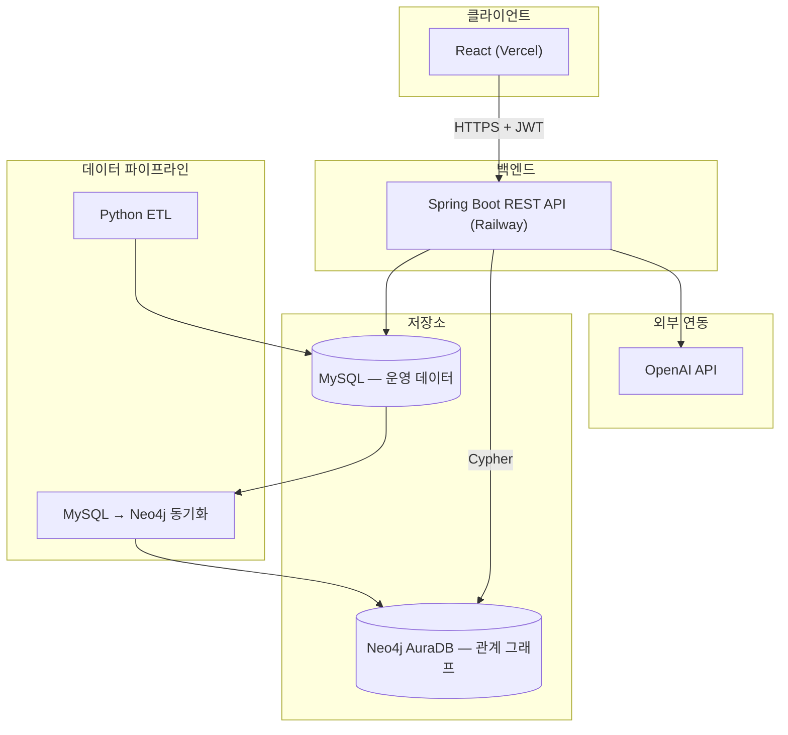

## 프로젝트 개요

축구 팬이 원하는 포메이션에 자신만의 베스트 11을 구성하고, 그래프 기반 추천과 AI 코멘트를 받아보는 풀스택 웹 서비스. 기획부터 데이터 파이프라인, 백엔드, 프론트엔드, 배포까지 전 과정을 1인 개발.

- **배포 URL**: https://my-best-11-fe-inky.vercel.app
- **API 문서**: https://mybest11-be-production.up.railway.app/swagger-ui/index.html
- **GitHub**: https://github.com/hyunsu1004/MyBEST11-BE

---

## 역할

풀스택 개발자 겸 데이터 엔지니어로서 아래 전 영역을 단독으로 설계·구현했습니다.

- 요구사항 정의, ERD 및 API 설계
- Spring Boot 기반 백엔드 개발 (인증, 도메인 로직, 예외 처리)
- Python ETL 파이프라인 설계 및 구현
- MySQL–Neo4j 폴리글랏 퍼시스턴스 아키텍처 설계
- React 프론트엔드 개발
- 외부 LLM API(OpenAI) 연동
- 클라우드 배포 및 인프라 구성 (Railway, Vercel, Neo4j AuraDB)

---

## 기술 스택

| 영역 | 기술 |
|---|---|
| Backend | Java 17, Spring Boot 3.5, Spring Data JPA, Spring Security, JWT |
| Database | MySQL 8.0 (Railway), Neo4j (AuraDB) |
| Migration | Flyway |
| Data Pipeline | Python, pymysql, requests, python-dotenv, neo4j-driver |
| Frontend | React 19, Vite, React Router, Axios |
| AI 연동 | OpenAI API (GPT-4o-mini) |
| API 문서화 | springdoc-openapi (Swagger) |
| 배포 | Railway (Backend, MySQL), Vercel (Frontend), Neo4j AuraDB |
| 버전관리/협업 | Git, GitHub |

---

## 시스템 아키텍처

**설계 근거**: 트랜잭션성 CRUD(회원, 라인업 저장)는 MySQL이 담당하고, "같은 팀 동료", "유사 포지션 선수" 같은 다단계 관계 탐색은 Neo4j Cypher 쿼리로 처리. 동일 요구사항을 SQL 다중 JOIN으로 구현하는 것보다 그래프 순회가 직관적이고 확장에 유리하다는 판단 하에 폴리글랏 퍼시스턴스로 설계.

---

## 핵심 기능

- JWT 기반 stateless 인증
- 포메이션(4-3-3/4-4-2/3-5-2) 기반 라인업 빌더, 포지션별 선수 배치
- 선수 검색(디바운스 적용) 및 실시간 배치
- 그래프 기반 추천 (같은 팀 동료 / 같은 리그 유사 포지션)
- LLM 기반 라인업 전술 평가 코멘트
- Python ETL 파이프라인 (upsert 패턴, 재실행 안전성 확보)

---

## 트러블슈팅 & 문제 해결

### 1. 폴리글랏 퍼시스턴스 환경에서의 트랜잭션 매니저 충돌

**문제**: MySQL(JPA)과 Neo4j를 함께 사용하는 상황에서, Neo4j Repository 쿼리 실행 시 `NullPointerException: txTemplate is null` 발생.

**원인 분석**: Spring Boot는 애플리케이션에 하나의 주 트랜잭션 매니저만 자동 구성하며, JPA가 우선 감지되어 Neo4j용 트랜잭션 매니저가 등록되지 않은 상태였음.

**해결**: `Neo4jTransactionManager`를 별도 Bean으로 명시적으로 등록하고, 서비스 메서드에 `@Transactional("neo4jTransactionManager")`로 트랜잭션 경계를 명시적으로 분리하여 두 저장소의 트랜잭션이 독립적으로 관리되도록 구성.

**배운 점**: 여러 데이터스토어를 한 애플리케이션에서 다룰 때는 트랜잭션 경계를 명시적으로 설계해야 하며, Spring Boot의 자동 구성에 의존할 수 없는 지점을 식별하는 것이 중요함.

---

### 2. Flyway 도입 중 발견한 숨은 스키마 결함

**문제**: 개발 초기 `ddl-auto: create-drop`으로 운영하다가, 배포를 앞두고 Flyway 기반 마이그레이션으로 전환하는 과정에서 `Schema-validation: missing column [titie] in table [best_eleven]` 에러 발생.

**원인 분석**: Entity 클래스에 `title` 필드가 `titie`로 오타가 있었으나, `create-drop` 모드에서는 Hibernate가 엔티티 필드명 그대로 테이블을 생성했기 때문에 오타가 계속 은폐되어 있었음. Flyway로 정확한 스펠링의 마이그레이션 스크립트를 작성하자, 스키마 검증 과정에서 불일치가 드러남.

**해결**: Entity 필드명을 수정하고 관련 DTO를 함께 점검.

**배운 점**: `ddl-auto: create-drop`은 개발 편의성은 높지만 스키마 결함을 은폐할 수 있음을 체감. 명시적 스키마 관리(Flyway) 도입이 코드 품질 검증 수단으로도 기능한다는 것을 실무적으로 확인.

---

### 3. 외부 API 제약에 따른 데이터 소싱 전략 전환

**문제**: 무료 축구 데이터 API(football-data.org)를 사용해 ETL 파이프라인을 구축하던 중, 선수단(squad) 및 팀 목록 엔드포인트가 무료 티어에서 제한되어 있음을 확인 (403 Forbidden).

**의사결정**: 유료 구독 대신, 팀 목록은 접근 가능한 기본 API 엔드포인트로 확보하고, 선수 데이터는 CSV로 직접 큐레이션하는 방식으로 전환. API 의존성을 최소화하고 파이프라인 로직 검증에 집중하는 실용적 선택.

**구현**: `extract.py`/`transform.py`는 향후 API 재도입을 대비해 유지하되, `main.py`가 CSV 소스를 읽도록 재구성. 모든 적재 함수를 upsert 패턴(조회 후 삽입)으로 작성하여 파이프라인 재실행 시 중복 데이터가 발생하지 않도록 설계.

**배운 점**: 외부 의존성의 제약을 조기에 식별하고, 프로젝트 목표(파이프라인 검증)에 맞게 데이터 소싱 전략을 유연하게 전환하는 판단력.

---

### 4. 클라우드 배포 환경에서의 네트워크 계층 이슈

**문제**: Railway 배포 과정에서 세 단계에 걸쳐 서로 다른 네트워크 문제 발생.

1. 로컬에서 클라우드 DB 연결 시 `mysql.railway.internal` 사용 → `UnknownHostException` (내부 전용 주소를 외부에서 접근 시도)
2. 백엔드를 Railway에 배포했으나 동일 에러 재발 → MySQL과 백엔드 서비스가 서로 다른 Railway 프로젝트에 속해 있어 사설 네트워크가 분리되어 있었음
3. HTTPS로 서빙되는 Swagger 페이지에서 API 호출 시 Mixed Content 에러 → Railway가 외부 HTTPS 요청을 내부적으로 HTTP로 프록시하는데, Spring이 이를 인지하지 못해 자신을 HTTP 서버로 오인

**해결**:
1. 로컬 개발 시에는 Public 프록시 주소, 배포된 서비스 간 통신에는 Private 주소를 구분해서 사용
2. 두 서비스를 동일 프로젝트로 재구성해 사설 네트워크 공유
3. `server.forward-headers-strategy: framework` 설정으로 프록시 헤더(`X-Forwarded-Proto`)를 신뢰하도록 구성

**배운 점**: 클라우드 배포 환경에서는 "누가, 어디서 접속하는가"에 따라 내부/외부 네트워크 경로를 구분해서 설계해야 함을 체득. 로컬 개발 환경과 클라우드 배포 환경의 네트워크 토폴로지 차이를 이해하는 계기.

---

### 5. 재현 가능한 빌드를 위한 환경 명시

**문제**: Railway의 자동 빌드 시스템(Railpack)이 프로젝트의 Java 버전을 자동 감지하지 못해 빌드 실패.

**해결**: `RAILPACK_JDK_VERSION=17` 환경변수를 명시적으로 지정하여 빌드 환경의 JDK 버전을 고정. 이 과정에서 Nixpacks/Railpack 등 툴체인 간 설정 형식 차이를 확인하고, 파일 기반 설정보다 환경변수 기반 설정이 더 안정적임을 확인.

**배운 점**: 로컬 개발 환경에서 암묵적으로 가정하던 실행 환경(Java 버전 등)을 배포 시에는 명시적으로 선언해야 한다는 걸 실전에서 경험. Reproducible build의 중요성.

---

## 회고

이 프로젝트를 통해 다음을 실무 수준으로 경험했습니다.

- **폴리글랏 퍼시스턴스**: 단일 DB로는 자연스럽지 않은 요구사항(관계 탐색)을 그래프DB로 분리 설계하고, 그 과정에서 발생하는 트랜잭션 경계 문제를 직접 해결
- **데이터 파이프라인 설계**: 외부 API 제약이라는 현실적 문제에 부딪혔을 때, 목표에 맞게 전략을 전환하는 실용적 판단
- **스키마 관리의 중요성**: 임시방편(create-drop)에서 정식 마이그레이션 도구(Flyway)로 전환하며 겪은 문제가, 역설적으로 숨어있던 버그를 드러내는 안전장치 역할을 한다는 것을 체감
- **클라우드 인프라 이해**: 로컬 개발 환경과 배포 환경의 네트워크·런타임 차이를 다수의 시행착오를 통해 체득

특히 "동작하는 코드"와 "운영 가능한 서비스" 사이에는 스키마 관리, 네트워크 구성, 환경 변수 관리 등 눈에 보이지 않는 인프라적 고려사항이 많다는 것을 배포 과정에서 절실히 느꼈습니다.
